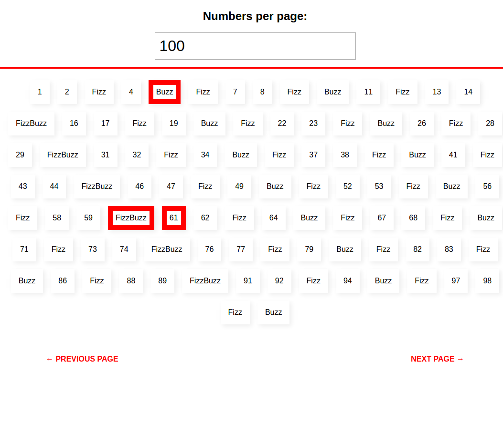

# MegaFizz Frontend React application
 
https://young-refuge-49828.herokuapp.com

### Info

React application for displaying fizzbuzz numbers & favorite number.
- Two main components: Number & NumbersCollection
- FlexBox for numbers positioning
- You can change numbers per page value from input at the top. Just update number and hit Enter
- favorite number is based on two state logic: update style in the app & send request to the api server

### Deployment
`git subtree push --prefix front_app heroku_front master`

### Screenshots

